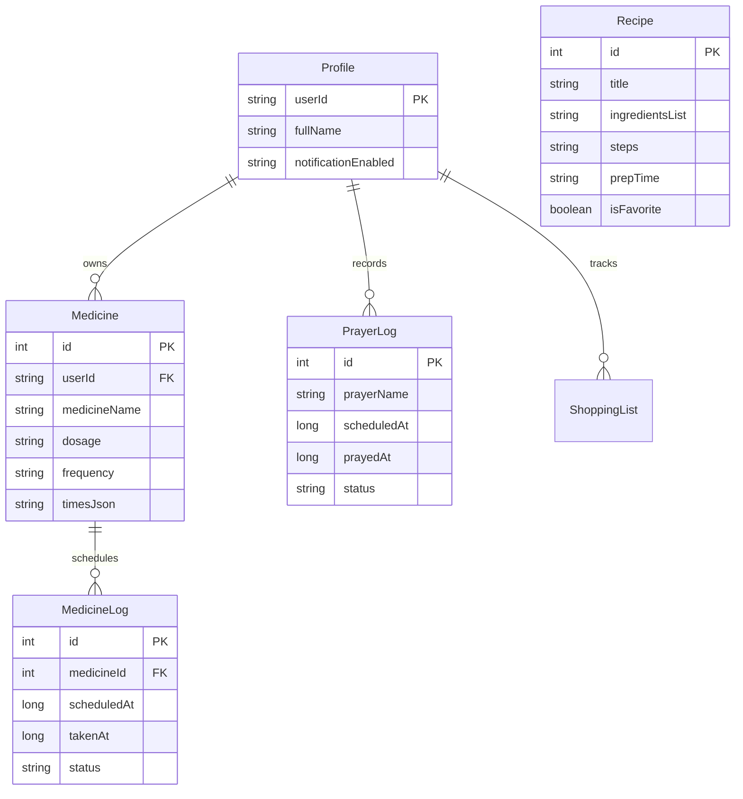

# 🕋 আম্মু অ্যাপ (Ammu App) — মায়েদের ডিজিটাল ডায়েরি ও লাইফস্টাইল সহকারী

[](https://github.com/ta-syn/ammu-android/actions/workflows/android-build.yml)
[](https://developer.android.com)
[](https://kotlinlang.org)
[](https://developer.android.com/jetpack/compose)
[](https://developer.android.com/training/data-storage/room)

**আম্মু অ্যাপ (Ammu App)** হলো বাংলাদেশি মায়েদের দৈনন্দিন জীবনকে সহজ, সুশৃঙ্খল এবং আধ্যাত্মিক ভাবগাম্ভীর্যপূর্ণ করতে বিশেষভাবে ডিজাইনকৃত একটি প্রিমিয়াম মোবাইল অ্যাপ্লিকেশন। জেটপ্যাক কম্পোজ (Jetpack Compose), লোকাল রুম ডাটাবেজ (Room Database), ওপেনরাউটার এআই (OpenRouter AI) এবং সুপাবেস এজ ফাংশন (Supabase Edge Functions) দিয়ে নির্মিত এই অ্যাপটি মায়েদের প্রাইভেসি সুরক্ষিত রেখে সব ফিচার রিয়েল-টাইমে অফার করে।

---

## 🎨 অ্যাপ আইকন ও ব্র্যান্ডিং

অ্যাপের লোগোটিতে একটি বৃত্তাকার ডিপ-গ্রিন পটভূমির ওপর স্বর্ণালী চাঁদ এবং তার ভেতর অত্যন্ত মার্জিতভাবে হিজাব পরিহিত মায়ের একটি বিমূর্ত মেটালিক এমব্লেম ফুটিয়ে তোলা হয়েছে। এটি অ্যাপের প্রাইমারি সবুজ (`#013E37`) এবং গোল্ডেন হলুদ (`#FFEFB3`) রঙের সিগনেচার থিমকে রিপ্রেজেন্ট করে।

### 🎨 ব্র্যান্ড কালার প্যালেট (Brand Colors)
| কালার টোকেন | হেক্স কোড (Hex) | ব্যবহারের স্থান |
| :--- | :--- | :--- |
| **GreenPrimary** | `#013E37` | প্রাইমারি ব্র্যান্ড কালার, অ্যাপ ব্যাকগ্রাউন্ড, হিজাবের রঙ |
| **GreenLight** | `#027A6B` | সফল অ্যাকশন, টিকিট স্ট্যাটাস, ট্র্যাকার একটিভ ডে |
| **GoldAccent** | `#FFFFEFB3` | মেটালিক ক্রিসেন্ট চাঁদ, নোটিফিকেশন ব্যাজ, হাইলাইটেড এরিয়া |
| **SurfaceLight** | `#FFFFFEF5` | মায়েদের জন্য আরামদায়ক হালকা ক্রিম কালার ব্যাকগ্রাউন্ড |

---

## 🚀 মূল স্ক্রিন ও ফিচারসমূহ (Screens & Features)

### ১. এআই রেসিপি ও বাজার সহকারী (AI Kitchen Assistant)
* **ইনগ্রিডিয়েন্ট-টু-রেসিপি**: ফ্রিজে বা রান্নাঘরে থাকা উপকরণের নাম লিখলেই ওপেনরাউটার এআই জেনারেটরের মাধ্যমে সম্পূর্ণ রেসিপি ধাপে ধাপে তৈরি হয়।
* **ডুয়াল মডেল ফলব্যাক**: স্টেবিলিটি নিশ্চিত করতে `Gemma 3 27B` থেকে ব্যর্থ হলে স্বয়ংক্রিয়ভাবে `Llama 3 8B` মডেলে চলে যায়।
* **স্মার্ট বাজার তালিকা**: কোনো রেসিপি পছন্দ হলে এক ক্লিকেই প্রয়োজনীয় উপকরণের একটি পার্সড শপিং লিস্ট তৈরি হয়ে সরাসরি লোকাল শপিং ডাটাবেজে যুক্ত হয়।

### ২. ইসলামিক লাইফস্টাইল ও ইবাদত ট্র্যাকার
* **গাণিতিক নামাজের সময়সূচী**: ব্যবহারকারীর রিয়েল-টাইম লোকেশন (Coarse/Fine GPS) হিসাব করে নামাজের সঠিক সময় গাণিতিক উপায়ে বের করা হয়।
* **সাপ্তাহিক ট্র্যাকার হিটম্যাপ**: মায়েরা সারা সপ্তাহে কত ওয়াক্ত নামাজ পড়েছেন তার একটি ডেটাবেজ-ভিত্তিক ট্র্যাকার গ্রিড (হিটম্যাপ) রেন্ডার হয়।
* **ডাইনামিক হিজরি ক্যালেন্ডার**: জাভা টাইম এআই দিয়ে ক্যালকুলেট করে খাঁটি বাংলা সংখ্যা ও আরবি মাসের নামে হেডার আপডেট করা হয়।
* **কুরআন, দোয়া ও তাসবিহ**: ১7টি সহীহ দোয়া ও সূরা সম্বলিত ডাটাবেজ, একটি ডাইনামিক ডিজিটাল তাসবিহ কাউন্টার এবং কিবলা কম্পাস।

### ৩. স্বাস্থ্য ও ঔষধ রিমাইন্ডার (Health & Medicine Planner)
* **ঔষধের রুটিন**: কোনো ঔষধ রেজিস্টার করার সাথে সাথে ১x, ২x বা ৩x ডেইলি ফ্রিকোয়েন্সির ওপর ভিত্তি করে আগামী ৭ দিনের জন্য ডাটাবেজে রিয়েল লগ প্রাক-প্রজন্ম (Pre-generate) করা হয়।
* **সহজ চেক-অফ**: মায়েরা কখন ঔষধ খেয়েছেন তা সরাসরি টিক দিয়ে মার্ক করতে পারেন যা পরবর্তীতে এজ ফাংশন দ্বারা ট্র্যাক করা হয়।

### ৪. দৈনিক খবর ও ইউটিলিটি
* **বিবিসি বাংলা লাইভ আরএসএস**: বিবিসি বাংলার অফিশিয়াল আরএসএস ফিড থেকে রিয়েল-টাইম খবর পার্স করে ডাটাবেজ ক্যাশিং-এর মাধ্যমে অফলাইনেও প্রদর্শন করে।
* **খরচ হিসাব ও আবহাওয়া**: পারিবারিক খরচের দৈনিক হিসাব রাখার খাতা এবং ওপেনওয়েদার এপিআই দিয়ে বর্তমান শহরের রিয়েল-টাইম আবহাওয়া প্রদর্শন।

---

## 🛠️ টেকনিক্যাল স্ট্যাক ও ব্যবহৃত লাইব্রেরিসমূহ (Libraries Used)

অ্যাপ্লিকেশনটিতে সর্বোচ্চ কোয়ালিটি ও পারফরম্যান্সের জন্য নিম্নলিখিত লাইব্রেরিসমূহ ব্যবহৃত হয়েছে:

| লাইব্রেরি | ক্যাটাগরি | ব্যবহারের উদ্দেশ্য |
| :--- | :--- | :--- |
| **Jetpack Compose (BOM)** | UI Framework | আধুনিক, ডিক্লারেটিভ এবং ইন্টারেক্টিভ মেটেরিয়াল ৩ ইউজার ইন্টারফেস। |
| **Room Database (SQLite)** | local storage | মায়েদের ডাটা সম্পূর্ণ ব্যক্তিগত রাখতে সব ডায়েরি ও ট্র্যাকার অফলাইনে সেভ রাখা। |
| **Retrofit & OkHttp** | Networking | বিবিসি নিউজ ফিড, ওপেনরাউটার ও সুপাবেস এপিআই কল করার জন্য। |
| **Moshi (Kotlin JSON)** | Parsing | JSON ডাটা নিরাপদে ও দ্রুত অবজেক্টে রূপান্তর করার জন্য। |
| **Google Play Services Location** | Sensors | গাণিতিক নামাজের সময় গণনার জন্য বর্তমান অক্ষাংশ ও দ্রাঘিমাংশ সংগ্রহ। |
| **Accompanist Permissions** | Permissions | রানটাইম লোকেশন পারমিশন সহজ ডায়ালগের মাধ্যমে নিশ্চিত করা। |
| **Compose Navigation** | Navigation | অ্যাপের ২১টি মূল স্ক্রিনের মধ্যে মসৃণ ও দ্রুত ট্রানজিশন নেভিগেশন। |

---

## 💾 ডাটাবেজ ডিজাইন ও স্কিমা (Room Database Entities)

মায়েদের তথ্যের পূর্ণ সুরক্ষায় অ্যাপটি অফলাইনে মোট ৭টি SQLite টেবিল পরিচালনা করে:



---

## ⚡ সুপাবেস ও ডেনো এজ ফাংশনস (Supabase Deno Edge Functions)

অ্যাপ্লিকেশনটির ক্লাউড ইন্টিগ্রেশন ব্যাকএন্ডে **Supabase Deno Edge Functions** ব্যবহৃত হয়েছে যা কোনো ক্লাউড সার্ভার ছাড়াই ব্যাকগ্রাউন্ড টাস্ক প্রসেস করে:

| ফাংশন ডিরেক্টরি | রান সিডিউল (pg_cron) | কাজের বিবরণ |
| :--- | :--- | :--- |
| [`daily-content`](supabase/functions/daily-content/index.ts) | `0 0 * * *` (প্রতিদিন সকাল ৬:০০) | ওপেনরাউটার এআই দিয়ে মায়েদের জন্য প্রতিদিন সকালে নতুন হাদিস ও টিপস জেনারেট করে। |
| [`medicine-reminders`](supabase/functions/medicine-reminders/index.ts) | `* * * * *` (প্রতি মিনিটে) | সময় মেলানো মাত্রই মায়ের ফোনে পরবর্তী ঔষধ সেবনের রিমাইন্ডার পুশ করে। |
| [`prayer-notifications`](supabase/functions/prayer-notifications/index.ts) | `*/5 * * * *` (প্রতি ৫ মিনিটে) | পরবর্তী ওয়াক্তের আযানের সময়সূচী নিয়ে সাইলেন্টলি অ্যালার্ট পাঠায়। |
| [`weekly-report`](supabase/functions/weekly-report/index.ts) | `0 3 * * 0` (প্রতি রবিবার সকাল ৯:০০) | সারা সপ্তাহের নামাজের হার ও ওষুধের শতকরা হিসাব করে উইকলি রিফ্লেকশন দেয়। |
| [`wellness-check`](supabase/functions/wellness-check/index.ts) | `0 4 * * *` (প্রতিদিন সকাল ১০:০০) | মায়েরা কেমন আছেন তা জানার জন্য ডেইলি সেলফ-কেয়ার ইন্টারেক্টিভ প্রশ্ন পাঠায়। |

---

## 🚀 লোকাল রান এবং বিল্ড করার নিয়ম

### ১. লোকাল পরিবেশ সেটআপ (.env)
প্রজেক্টের রুট ডিরেক্টরিতে একটি `.env` ফাইল তৈরি করুন এবং আপনার ক্রেডেনশিয়ালস দিন:
```env
OPENROUTER_API_KEY=your_openrouter_api_key
SUPABASE_URL=your_supabase_project_url
SUPABASE_ANON_KEY=your_supabase_anon_key
```

### ২. অ্যান্ড্রয়েড স্টুডিওতে রান করা
1. **Android Studio** ওপেন করে `আম্মু` প্রজেক্ট ফোল্ডারটি নির্বাচন করুন।
2. গ্র্যাডল সিঙ্ক (Gradle Sync) সম্পন্ন হওয়া পর্যন্ত অপেক্ষা করুন।
3. আপনার অ্যান্ড্রয়েড ফোনটি USB-র মাধ্যমে কানেক্ট করে অথবা একটি ইমুলেটর চালু করে **`Run (Green Play Button)`**-এ চাপুন।

### ৩. গিটহাব সিআই/সিডি (Automatic APK Build)
আপনি যখনই আপনার লোকাল গিটহাবে কোড পুশ করবেন, গিটহাব স্বয়ংক্রিয়ভাবে ব্যাকগ্রাউন্ডে বিল্ড টাস্ক রান করবে:
```bash
git add .
git commit -m "Updated code structure and logic"
git push origin main
```
বিল্ড শেষ হলে সরাসরি গিটহাবের **`Actions`** ট্যাবে গিয়ে **`Ammu-App-Debug-APK`** সেকশন থেকে নতুন APK জিপ ফাইলটি ডাউনলোড করতে পারবেন।
